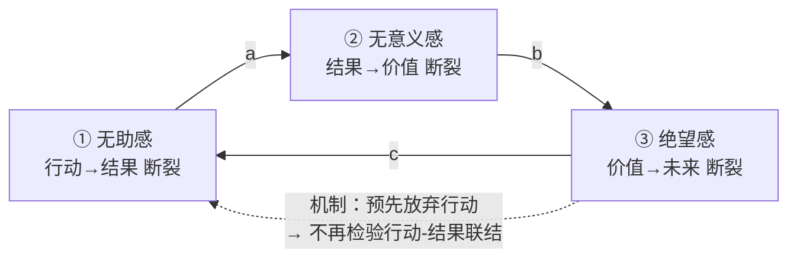

# 三感闭环实验设计：无助感 · 无意义感 · 绝望感

**核心问题**：无助感、无意义感、绝望感是否构成一个**自我强化的因果闭环**，
而不只是同一种负性情绪的三个名字？

**一句话设计**：把三感定义为「动机链」上三处不同的断裂 → 先证三条边、再证闭环放大、
再证断任一环即可破环 → 同时用「悲伤对照臂」排除「这只是心情不好」的替代解释。

> 本文档是**面向真人被试的实验设计方案**（预注册草案）。
> 配套功效分析脚本：[`loop-power-sim.js`](./loop-power-sim.js)（`node docs/experiments/loop-power-sim.js`）。
> 涉及负性情绪诱导，**必须先通过伦理审查**，§10 是不可裁剪的部分。

---

## 1. 构念界定：三感 = 动机链上三处断裂

多数研究把这三者混在「抑郁 / 士气低落（demoralization）」里。本设计的第一个主张是
它们可以被**结构性地区分开**——动机要成立，需要一条完整的链：

```
        行动  ──①──▶  结果  ──②──▶  价值  ──③──▶  未来
      (我做)         (会发生)        (值得)        (还会更好)
```

| 构念 | 断裂位置 | 核心信念 | 理论来源 |
|---|---|---|---|
| **无助感** Helplessness | ① 行动 → 结果 | 「我做什么都不影响结果」 | Seligman 习得性无助；Hiroto & Seligman (1975) 的三联设计 |
| **无意义感** Meaninglessness | ② 结果 → 价值 | 「结果发生了，但不重要」 | 意义维持模型 (Heine, Proulx & Vohs, 2006)；Ariely 的西西弗斯任务 |
| **绝望感** Hopelessness | ③ 价值 → 未来 | 「以后也不会变好」 | Abramson 绝望理论；Beck 绝望量表 (BHS) |

三者的判别要点：**无助**是「当下的控制」，**无意义**是「结果的价值」，**绝望**是「时间上的可变性」。
一个人可以无助但不绝望（"这轮我控制不了，下轮换个方法也许行"），
也可以有控制感但觉得无意义（"我能做完，但做完了也没人看"）。
这种可分离性本身就是 Study 0 的检验对象（§5）。

### 闭环假设



- **边 a（无助 → 无意义）**：努力不改变结果 → 努力失去工具性 → 「做这件事没有意义」。
- **边 b（无意义 → 绝望）**：结果不值得 → 未来没有值得期待的目标 → 「不会变好」。
- **边 c（绝望 → 无助）**：预期不会变好 → **预先放弃尝试** → 不再有机会体验到
  「行动确实影响结果」→ 无助感被自己的不行动所证实。
  这是闭环的关键边，也是自我实现预言的落点。

---

## 2. 假设

**主假设（闭环）**

- **H1（三条边）**：分别操纵任一构念，会显著升高其下游构念，且效应在统计控制另两者后仍存在。
  - H1a：无助诱导 → 无意义感 ↑
  - H1b：无意义诱导 → 绝望感 ↑
  - H1c：绝望诱导 → 无助感 ↑（含行为指标：坚持时间 ↓、随因判断准确性 ↓）
- **H2（闭环放大）**：**一次性**诱导后，在无新诱导的后续轮次中三感**不衰减反而上升**；
  被试内交叉滞后路径 a、b、c 同时为正，环增益 `a·b·c` 显著大于 0。
- **H3（断环）**：在第 k 轮对**任一**节点施加恢复性干预，都会压平三感的上升斜率；
  三个入口的效应量方向一致、量级可比。

**竞争假设（必须能被这套设计否证）**

- **C1（单因子）**：三感只是同一个负性情绪因子的不同措辞 → 由 Study 0 的 CFA/双因子模型
  与 Study 1 的**悲伤对照臂**检验。
- **C2（纯线性链）**：只有 H→M→D，没有闭环边 c → 由 H3 的**三入口对称性**检验。
  纯链预测「在链首干预效果最大、在链尾干预只影响自身」；闭环预测三入口皆可破环。
- **C3（需求特征 / 疲劳）**：上升只是被试猜到假设或单纯累了 → 由 yoked 对照、
  漏斗式询问（funnel debriefing）、疲劳协变量、行为指标检验。

---

## 3. 「循环」的四条验证标准（方法论核心）

单个实验无法验证闭环。本设计把「循环验证」拆成四个可独立否证的标准：

| # | 标准 | 判据 | 对应研究 |
|---|---|---|---|
| **V1** | 构念可分 | 三因子模型优于单因子；操纵-构念矩阵对角显著、非对角弱 | Study 0 |
| **V2** | 每条边成立 | 三条实验操纵各自使下游构念升高（实验因果链设计） | Study 1 |
| **V3** | 闭环有增益 | 一次诱导后自发放大；`a·b·c` 的 bootstrap CI 不含 0 | Study 2 |
| **V4** | 断环可逆 | 任一节点干预都压平三者斜率，且三入口效应量可比 | Study 3 |

四条都过 → 支持闭环。V2 过而 V3/V4 不过 → 只是线性链或一次性溢出。
V1 不过 → 整个构念区分失败，结论退回「士气低落」单因子。

**采用实验因果链设计**（Spencer, Zanna & Fong, 2005）而非纯统计中介：
逐段操纵、逐段测量，避免把测量到的相关当成因果。

---

## 4. 操纵与测量

### 4.1 三种诱导（各自只打断动机链的一处）

| 操纵 | 目标 | 材料 | 保持完好的部分（判别性的关键） |
|---|---|---|---|
| **无助诱导** | ① | 「概念辨别」任务：屏幕上两组图形，被试选规则，反馈**与选择无关**（预设序列）。采用**三联设计**：随因组 / yoked 非随因组（收到与随因组完全相同的成败序列，但反馈不随因） / 无任务基线 | 任务本身有意义、明确说明「后面几轮通常会进步」 |
| **无意义诱导** | ② | 西西弗斯任务：被试完成字母配对/拼装，**每轮完成后成果在其眼前被清空**，并告知「本轮数据不会被保存或使用」。对照组成果被保留并告知将用于后续分析 | **随因性完好**（做得对就会被判对，进度条真实反映操作），明确说明「你完全能做好」 |
| **绝望诱导** | ③ | 「能力画像」虚假反馈：「你的作答模式提示这类任务的表现**高度稳定，很少随练习改变**」（稳定-全局归因框架）。对照组：「表现**主要取决于策略，练习可以明显改善**」（不稳定-特定） | 当下控制与当下意义完好，只改变**未来可变性**的预期 |
| **悲伤对照臂** | 效价控制 | 标准负性情绪诱导（悲伤影片片段 + 回忆写作），不涉及控制/意义/未来 | 若此臂也产生同样闭环，则 C1 成立、三感区分失败 |

每个操纵都必须通过 Study 0 的**校准**：使自己的靶构念上升 ≥ 0.6 SD，
而使另两个构念的即时上升 < 0.25 SD。达不到就改材料，不进入正式研究。

### 4.2 状态量表（每题 1–7，可重复测量；完整条目见附录 A）

每个构念 4 题（含 1 题反向），总共 12 题，单轮作答 < 60 秒，支持 8 轮重测。

- 无助感：「不管我怎么做，结果都不会改变」／「我能控制接下来会发生什么」(R)
- 无意义感：「我现在做的事没有任何意义」／「我做的事对某些人或某些事是有价值的」(R)
- 绝望感：「就算继续下去，情况也不会好转」／「我对接下来的几轮抱有期待」(R)

### 4.3 行为指标（对抗自评的共同方法方差）

| 指标 | 测什么 | 操作化 |
|---|---|---|
| 坚持时间 | 无助/绝望 | 在一个（实际不可解的）字谜上放弃前的秒数与尝试次数 |
| **随因判断准确性** | **客观**无助 | 随因判断任务：真实 ΔP 已知（0 / .4 / .8），被试估计「我的按键对结果的影响有多大」，取估计误差 |
| 为控制付费 | 能动性 | 愿意放弃多少报酬来换取「自己决定下一轮难度」 |
| 投入选择 | 无意义 | 在「做一个会被保存的任务」与「等量时间空等」之间的选择比例 |
| 未来折扣 | 绝望 | 跨期选择中的延迟折扣率（绝望应提高对未来的折扣） |

### 4.4 协变量与判别测量

PANAS-SF（当下情绪）、状态焦虑、疲劳自评、一般自我效能、PHQ-9（筛查用，见 §10）、
人口学变量。**关键**：所有分析都要报告「控制 PANAS 负性分后三感的交叉滞后路径是否仍成立」。

---

## 5. Study 0：构念区分与操纵校准（预研究）

**目的**：过 V1，并校准三种诱导。没有这一步，后面全部研究都可被「你测的是同一个东西」推翻。

- **0A 心理测量（N = 250，在线横断 + 1 周重测 n = 80）**
  - CFA：三因子 vs 单因子 vs 双因子（一个一般负性因子 + 三个特异因子）。
    预注册判据：三因子模型 ΔCFI ≥ .01 优于单因子；各因子特异方差占比 ≥ 20%。
  - 跨轮测量等值性（configural → metric → scalar）。
  - 与 BHS、MLQ-Presence、一般自我效能、PHQ-9 的聚合/区分效度。
- **0B 操纵校准（4 臂 × n = 45 = 180）**
  - 三种诱导 + 中性对照，诱导后立刻测三感 → 得到 **3×3 操纵-构念矩阵**。
  - 判据：对角 ≥ 0.6 SD，非对角 < 0.25 SD（§4.1）。

---

## 6. Study 1：三条边的因果检验（V2）

**设计**：单个 **5 臂被试间**实验（比三个独立小实验更省样本，且同一批数据即可给出判别矩阵）。

| 臂 | 操纵 | 主要预测 |
|---|---|---|
| 1 | 中性对照 | 基线 |
| 2 | 无助诱导（yoked 非随因） | 无意义感 ↑（H1a） |
| 3 | 无意义诱导（西西弗斯） | 绝望感 ↑（H1b） |
| 4 | 绝望诱导（稳定-全局反馈） | 无助感 ↑ + 坚持时间 ↓ + 随因判断误差 ↑（H1c） |
| 5 | 悲伤诱导（效价对照） | 三感均不应显著超过对照臂（否证 C1） |

- **流程**：知情同意 → 筛查 → 基线三感+PANAS → 随机分组 → 诱导（≤ 8 分钟）→
  即时三感 → 行为任务组（字谜坚持 / 随因判断 / 为控制付费）→ 事后三感 →
  漏斗式询问 → **去欺骗与情绪恢复**（§10）→ 恢复后复测。
- **样本量**：目标 *d* = 0.40，α = .05（3 个主要对比用 Holm 校正），power = .90
  → **每臂 n = 133，共 N = 665**（在线被试，预留 15% 排除率 → 招募 780）。
- **分析**：以基线三感为协变量的 ANCOVA；主要对比为「臂2 vs 臂1 的无意义感」等三条；
  **稳健性**：把 PANAS 负性分作为额外协变量后三条边是否仍显著；
  臂 5 与臂 2/3/4 的对比用作效价特异性检验。

---

## 7. Study 2：闭环放大（V3）—— 本设计的核心

一条边成立不等于存在循环。循环的特征是**在没有新输入的情况下自发维持或放大**。

### 7.1 设计

- **一次性诱导，多轮观测**：第 1 轮施加无助诱导（或在稳健性分组中从其他节点起爆），
  此后 **7 轮**任务**不再施加任何诱导**，且客观随因性恢复正常。
  每轮结束后测 12 题状态量表 + 1 项苦恼度。
- **对照臂**：yoked 随因组（时长、成败次数、界面完全匹配，但反馈真实随因）。
- **轮次时长**：每轮约 2.5 分钟，全程 ≈ 30 分钟。

### 7.2 关键预测

- **H2a（放大 vs 衰减）**：诱导组三感的时间斜率 > 0 且显著大于对照组（对照组应回归基线）。
  若诱导组也向基线衰减 → 无闭环增益，只是一次性溢出。
- **H2b（环增益）**：被试内交叉滞后路径 â（H→M）、b̂（M→D）、ĉ（D→H）同时显著为正
  （联合显著检验），且 `â·b̂·ĉ` 的被试级 bootstrap 95% CI 不含 0。
- **H2c（序列特异性）**：反向路径（M→H, D→M, H→D）不应同时显著；
  若正反双向都成立，则应报告为「双向耦合」而非「单向闭环」。

### 7.3 统计模型

**RI-CLPM / 多层 VAR(1)**（Mplus 或 brms），把被试间差异（trait 水平）与被试内动态分离：

```
y_{i,t} = A · y_{i,t-1} + u_i + e_{i,t}          y = [无助, 无意义, 绝望]ᵀ
环增益 loop gain = a · b · c                      （bootstrap CI）
```

**关于谱半径 ρ(A) 的重要说明**：理论上 ρ(A) ≥ 1 才是「自持放大」。
本设计**不把 ρ 作为通过/不通过的判据**，原因有二：
(1) **伦理上不应该**在实验室里制造一个自持的绝望螺旋；
(2) **统计上估不准**——短面板的固定效应估计量对自回归系数有 Nickell 向下偏差，
仿真显示真值 φ = 0.35 在 T = 6 时只能估到 ≈ 0.115，导致 ρ̂ 被严重低估
（真值 0.50 → ρ̂ ≈ 0.225，见 §7.4 表）。
因此 ρ 只作**描述性报告**（附 CI 与偏差说明），放大的证据来自 **H2a 的组间比较**。

### 7.4 功效分析（来自配套仿真脚本）

`node docs/experiments/loop-power-sim.js`。生成模型见 §7.3；估计端用「被试内去均值 +
OLS + 按被试聚类的稳健 SE」，不施加零约束。**保守情景 a = b = c = 0.10，φ = 0.35，
被试间 SD = 0.8，被试内 SD = 1.0，每格 1000 次重复**：

|  N  |  T  | 功效（三边联合显著） | â / b̂ / ĉ 均值 | φ̂ 均值 | ρ̂ (SD) |
|----:|----:|---:|---|---:|---|
| 100 | 5 | 8.3% | .095 / .096 / .093 | .063 | 0.150 (.043) |
| 100 | 8 | 39.2% | .100 / .099 / .101 | .173 | 0.253 (.037) |
| 150 | 8 | 69.8% | .100 / .101 / .100 | .173 | 0.252 (.032) |
| 200 | 6 | 59.9% | .097 / .097 / .097 | .113 | 0.187 (.031) |
| **200** | **8** | **85.6%** | .102 / .099 / .098 | .174 | 0.253 (.027) |
| **300** | **8** | **98.3%** | .100 / .100 / .101 | .173 | 0.253 (.021) |

乐观情景（a = b = c = 0.15）下 N = 150, T = 6 即达 91.0%；但方案按保守情景定样本。
环增益 bootstrap CI 判据的功效与联合显著检验几乎一致
（N = 200, T = 8：87.0% vs 87.5%；N = 300, T = 8：96.5% vs 97.0%；200 次重复 × B = 400）。

> **结论：Study 2 定为 N = 300、T = 8 轮**（诱导组 150 + yoked 对照 150 时，
> 组内 N = 150 的功效只有 69.8%，故**每组 150 不够**；
> 采用 **诱导组 N = 300 + 对照组 N = 150，总计 450**，
> 交叉滞后模型在诱导组内估计，组间斜率比较用全样本。招募预留 20% 流失 → 540。)

### 7.5 起爆点稳健性

把诱导节点随机化（无助起爆 / 无意义起爆 / 绝望起爆，各 N = 100，嵌在上述 300 内）：
若闭环为真，三种起爆最终都应让三感同步上升，只是**到达顺序不同**——
这是比平均效应更强的证据，也是对 C2 的第一次检验。

---

## 8. Study 3：断环实验（V4）—— 区分闭环与线性链

**逻辑**：真闭环的诊断性特征是**在任何一个节点切断，整个环都会失效**。

- **设计**：所有被试先经 Study 2 式的一次性无助诱导 + 3 轮放大，
  在**第 4 轮**随机分配到 4 臂之一：

| 臂 | 干预 | 材料 |
|---|---|---|
| I-控制 | 恢复「行动→结果」 | 一段随因性清晰、反馈真实的小任务 + 明确的随因性说明 |
| I-意义 | 恢复「结果→价值」 | 告知成果将被保留并用于真实用途（如公益数据标注）+ 价值肯定写作 |
| I-希望 | 恢复「价值→未来」 | 不稳定-特定归因反馈 + 具体可改进路径（成长型框架） |
| 对照 | 无干预 | 等时长中性填充任务 |

- 干预后继续 4 轮观测（共 8 轮）。
- **主要预测（H3）**：三个干预臂相比对照，第 4–8 轮**三感的上升斜率均被压平**；
  **且三臂效应量方向一致、量级可比**（预注册的等效性检验：两两差异的 90% CI 落在 ±0.35 SD 内）。
- **对 C2 的判别**：纯线性链 H→M→D 预测 I-希望（链尾）只影响绝望感、不回流到无助感；
  闭环预测 I-希望同样能压低无助感的斜率。**这一条对比是全设计中信息量最大的单一检验。**
- **样本量**：斜率差异 *d* = 0.40，4 臂，power = .90，Holm 校正
  → **每臂 n = 100，共 N = 400**（招募 480）。

---

## 9. Study 4（可选）：生态效度

实验室的三感是「几十分钟量级」的状态，现实中的闭环是「周-月量级」的。

- **经验取样（EMA）**：N = 150，连续 14 天，每天 4 次推送，每次 12 题（约 40 秒）。
- 分析：多层 VAR / DSEM，估计**日内与日间**的三感交叉滞后；检验实验室中的
  a、b、c 是否在自然情境中复现。
- 附加：把「当日是否经历不可控事件」作为外生输入，检验闭环的自然起爆。
- **伦理**：EMA 不含任何诱导，仅观察；含自杀风险条目的实时预警与转介流程。

---

## 10. 伦理与被试保护（不可裁剪）

诱导无助与绝望**直接触及抑郁的核心认知**。以下全部为强制条款：

**准入筛查**
- 排除：PHQ-9 总分 ≥ 10，**或第 9 题（自杀意念）> 0**；正在接受精神科治疗或服药；
  近 6 个月内经历重大丧失；自述有抑郁/双相/创伤相关诊断史；未满 18 岁。
- 筛查在独立页面完成，被排除者照常获得报酬并看到资源清单（避免「被拒」体验本身造成伤害）。

**强度上限**
- 单轮诱导 ≤ 3 分钟，累计诱导 ≤ 20 分钟；Study 2/3 总时长 ≤ 45 分钟。
- 全程使用**轻度、短暂、可逆**的操纵；不使用人格贬损、社会排斥或健康相关的虚假信息。

**实时停止规则**
- 每轮加 1 项苦恼度（0–10）。**≥ 7 一次，或连续两轮 ≥ 6 → 程序立即终止**，
  跳转到恢复流程，全额报酬，记为按规则终止（不算流失，需在论文中报告终止率）。

**去欺骗与情绪恢复（强制流程，约 10 分钟）**
1. 逐条说明：反馈是预设的、任务是设计为不可解的、能力画像是虚构的 —— 且**与被试能力无关**。
2. 体验成功：完成一个真实可解、随因反馈明确的任务。
3. 正性情绪诱导 + 自我肯定写作（价值排序）。
4. **恢复后复测**三感 + PANAS，要求回到基线 ±0.5 SD 之内；未达标者延长恢复流程并由研究者个别联系。
5. 提供心理援助资源清单（含本地热线与校内咨询渠道）。

**随访**：Study 2/3 在 24 小时与 7 天发送随访问卷（三感 + PHQ-2），异常者主动联系。

**其他**：伦理委员会（IRB）审批；知情同意明确写出「可能出现短暂的挫败、无意义或
悲观感受」与「随时可无理由退出且不影响报酬」；数据匿名化；预注册与数据公开。

---

## 11. 替代解释与对应控制（速查）

| 替代解释 | 控制手段 |
|---|---|
| 三感 = 单一负性情绪（C1） | 悲伤对照臂；双因子 CFA；控制 PANAS 后重估所有路径 |
| 只是失败/挫败，不是「不可控」 | **yoked 三联设计**：对照组收到完全相同的成败序列，只差随因性 |
| 只是线性链，没有闭环（C2） | Study 3 的三入口对称性检验 + Study 2 的起爆点随机化 |
| 需求特征（猜到假设） | 漏斗式询问后排除识破者（预注册排除标准）；行为指标作汇聚证据 |
| 疲劳/厌倦导致的上升 | yoked 对照匹配时长；疲劳自评作协变量；轮次顺序内的练习效应建模 |
| 自评的共同方法方差 | 5 个行为指标（坚持时间、随因判断误差、为控制付费、投入选择、延迟折扣） |
| 实验者效应 | 全自动在线程序、标准化指令、研究者不接触分组信息 |
| 回归到均值 | 基线协变量；对照组的斜率作为参照而非绝对零 |

---

## 12. 预注册清单

- [ ] 假设 H1a–c、H2a–c、H3 与四条判据 V1–V4 的**判据数值**全部前置写明
- [ ] 主要结果变量与主要对比各一组，其余标为探索性
- [ ] 样本量与停止规则（来自 §7.4 仿真，脚本与随机种子一并上传）
- [ ] 排除标准：筛查不合格、识破假设、注意检查失败 ≥ 2 项、轮次缺失 > 25%
- [ ] 分析代码在看到数据前完成，用仿真数据跑通
- [ ] 伦理审批号；数据与材料的公开计划

## 13. 资源与时间表（估算）

| 阶段 | 样本 | 周期 |
|---|---|---|
| 伦理审批 + 材料开发 + 预注册 | — | 2–3 个月 |
| Study 0（测量 + 校准） | 430 | 1 个月 |
| Study 1（5 臂） | 665（招 780） | 1 个月 |
| Study 2（8 轮） | 450（招 540） | 1.5 个月 |
| Study 3（断环 4 臂） | 400（招 480） | 1.5 个月 |
| Study 4（可选 EMA） | 150 | 1 个月 |
| 分析与撰写 | — | 2 个月 |
| **合计** | **≈ 1950–2100 人** | **10–12 个月** |

## 14. 局限

1. 实验室诱导的是**分钟级状态**，与临床上月-年级的绝望不同量级；外推需要 Study 4 与临床样本。
2. 出于伦理，本设计**故意不去**制造自持放大（ρ ≥ 1）的螺旋，因此只能证明「存在正反馈增益」，
   不能证明「会失控」。
3. 三条边的操纵不可能做到完全纯净——即使通过 §4.1 的校准判据，仍有 < 0.25 SD 的溢出。
4. 在线被试的注意质量与行为指标（尤其坚持时间）的生态效度有限。
5. 文化差异：「意义」的测量对文化敏感，跨文化复制是必要的后续。

---

## 附录 A：状态量表条目（1 = 完全不符合，7 = 完全符合；(R) 为反向计分）

**无助感（行动→结果）**
1. 不管我怎么做，结果都不会改变。
2. 我的努力和我得到的结果之间没有关系。
3. 我能控制接下来会发生什么。**(R)**
4. 这里发生的事情，看起来更像是随机的。

**无意义感（结果→价值）**
1. 我现在做的这件事没有任何意义。
2. 我在这里花的时间是白费的。
3. 我做的事对某些人或某些事是有价值的。**(R)**
4. 就算我把它做完，这件事也不重要。

**绝望感（价值→未来）**
1. 就算继续下去，情况也不会好转。
2. 接下来我不可能做得更好。
3. 我对接下来的几轮抱有期待。**(R)**
4. 我看不到事情有变好的可能。

**苦恼度（安全监测，单题 0–10）**：此刻你感到难受/不适的程度。

> 条目需经 Study 0A 验证；正式使用前做认知访谈（n = 10）核对措辞歧义，
> 并检查 3 个反向题是否产生方法因子。

## 附录 B：配套脚本

```bash
node docs/experiments/loop-power-sim.js                        # §7.4 默认网格
node docs/experiments/loop-power-sim.js --a .10 --b .10 --c .10 --nsim 1000 --noboot
node docs/experiments/loop-power-sim.js --N 300 --T 8 --a .10 --b .10 --c .10
```

脚本内含：多层 VAR 数据生成、固定效应估计 + 聚类稳健 SE、环增益 bootstrap、
谱半径幂迭代。随机种子固定（20260917），结果可复现。

## 附录 C：主要参考脉络

- Seligman, M. E. P. (1975). *Helplessness*. / Hiroto & Seligman (1975), *JPSP* — 三联设计与人类习得性无助
- Abramson, Metalsky & Alloy (1989), *Psychological Review* — 绝望理论（稳定-全局归因）
- Beck et al. (1974) — Beck 绝望量表
- Heine, Proulx & Vohs (2006), *PSPR* — 意义维持模型
- Ariely, Kamenica & Prelec (2008), *JEBO* — 西西弗斯任务（成果被销毁降低坚持）
- Steger et al. (2006), *JCP* — 生命意义问卷 MLQ
- Spencer, Zanna & Fong (2005), *JPSP* — 实验因果链设计（优于统计中介）
- Hamaker, Kuiper & Grasman (2015), *Psychological Methods* — RI-CLPM
- Nickell (1981), *Econometrica* — 短面板动态模型的自回归偏差
